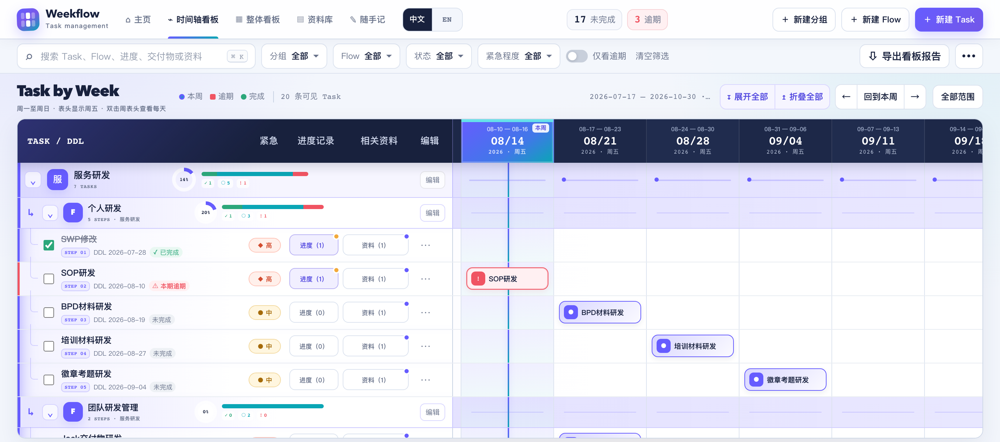
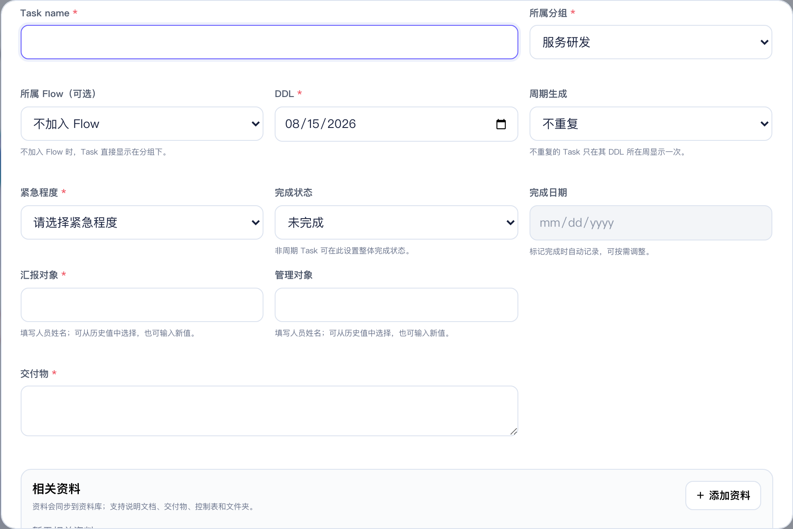
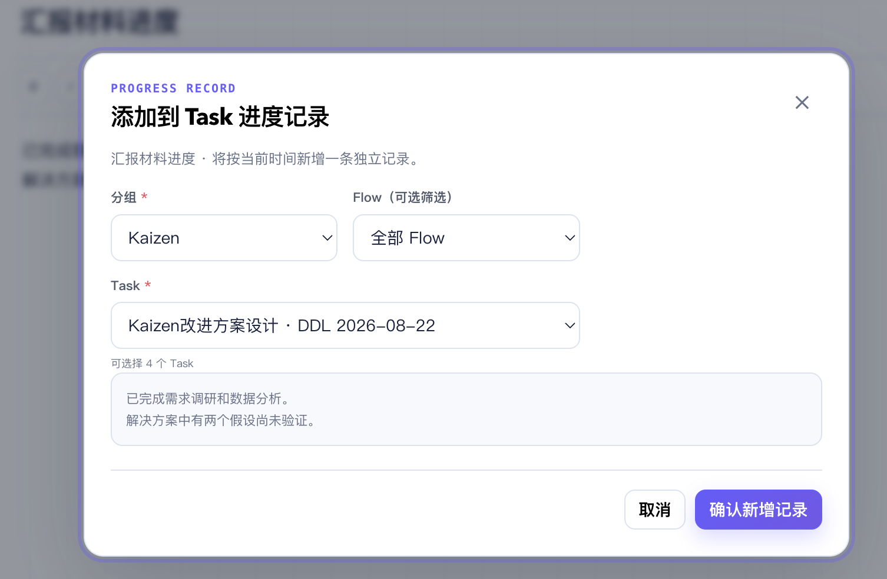
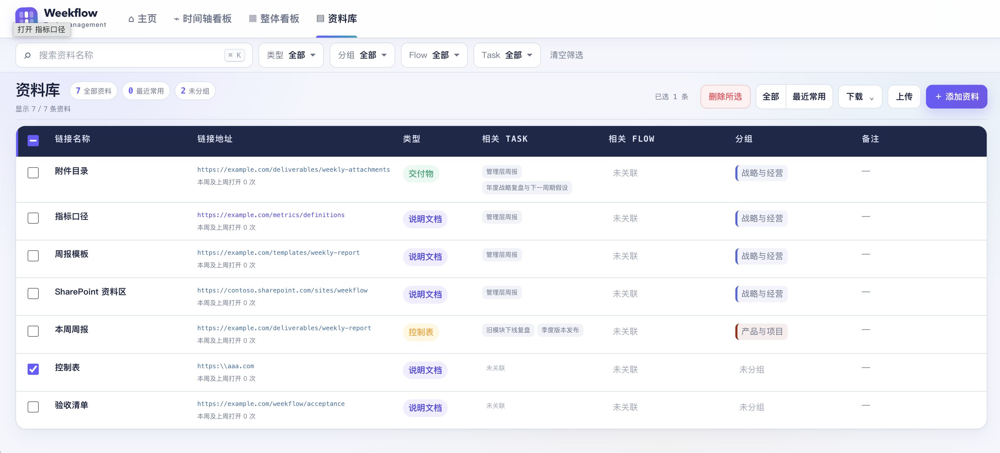
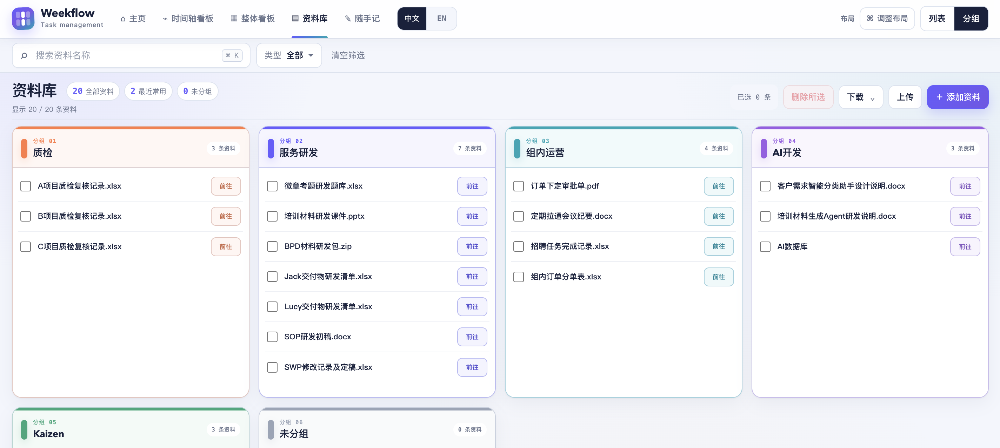
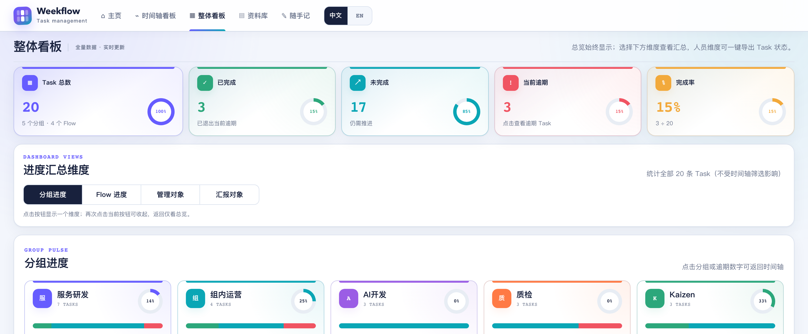
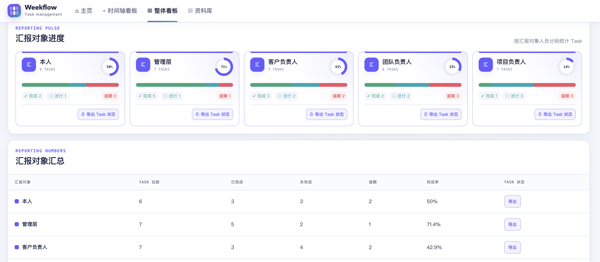

<p align="right"><strong>中文</strong> · <a href="README_EN.md">English</a></p>

# Weekflow v3.1 · Task management

Weekflow 是一个桌面端优先、无需后端的本地 Task 管理程序。它以自然周总览和单周日粒度下钻组织时间，通过“分组 → 可选 Flow → 有序 Task”组织工作，并提供随手记、多条进度历史、可选 AI 改写与 Task 草稿解析、整体看板、List / Group 双布局资料库、Excel 批量录入与本地备份。

程序由原生 HTML、CSS 和 JavaScript 构建，不需要安装前端依赖。本正式版从空白数据启动，不包含示例分组、Flow、Task、资料或恢复示例数据入口。

AI 功能完全可选：未配置 API Key 时，笔记转 Task 继续使用本地中英文规则；启用 AI 后，可对当前笔记进行改写，并优先用语义解析生成待复核的 Task 草稿。AI 不会绕过现有 Task 表单直接保存内容，API Key 也不会写入业务 JSON 备份。

## 快速启动

在本目录打开终端：

```bash
npm run serve
```

然后访问：

```text
http://localhost:8080/Weekflow.html
```

也可以直接双击 `Weekflow.html`。如果 Safari 对 `file://` 下载或存储有限制，请使用静态服务器并访问 `http://localhost:8080/Weekflow.html`。`file://`、`http://localhost:8080` 和其他地址各自拥有独立的浏览器存储空间。

这是一款 Multi-task 管理的座舱程序，具备多任务进度管理、任务相关资料汇总整理的功能。

## 主要功能

### 主页与导航


- 主页显示 Task、分组、Flow、资料数量和完成率。
- 提供时间轴看板、整体看板、资料库、随手记、使用说明和更新日志入口。
- 每次进入程序会在右下角显示未来 7 天内未完成 Task 的 DDL 提醒；提醒 10 秒后自动关闭，悬浮期间不阻断任何操作，关闭按钮采用清晰的图形化样式。
- 程序内更新日志按版本号从新到旧展示完整历史，而不是只显示当前版本内容。
- `Command/Ctrl + K` 在主页进入时间轴搜索，在资料库聚焦资料名称搜索，在随手记聚焦笔记搜索。

### 时间轴看板



- 主界面名称为 `Task by Week`。自然周按周一至周日计算，周列表头显示该周周五；周末 DDL 映射到同一自然周。
- `Task by Week` 支持前后浏览、回到本周和全部范围；全部范围最多生成 600 周。
- 双击任意周日期框进入该周的 `Task by Day`。日视图只显示 DDL 位于该周的 Task，并按周一至周日显示日期、星期和精确 DDL 落点。
- 周期 Task 会按所选周实际生成的周期 DDL 参与日视图筛选，仍然只保存和统计为一条 Task；其他周的 Task 不显示。
- `Task by Day` 保留分组、Flow、Task、筛选、编辑、完成以及展开折叠功能，不显示“回到本周”和“全部范围”，通过“返回 Task by Week”回到周时间轴。
- 从日视图返回会恢复进入前的周时间轴滚动位置；两个视图在完成 Task 或展开折叠后都保持被操作行位置，不会跳回首个分组。
- 分组和 Flow 均显示完成率环、状态堆叠条、精确数量与展开/折叠控制。
- 支持一键展开或折叠全部分组与 Flow，折叠状态会保存。
- 时间轴上方采用紧凑命令栏；分组、Flow、状态和紧急程度使用统一的高对比筛选弹层，点击其他筛选或页面空白处会自动收起。
- 时间轴的数据操作与筛选栏只在时间轴看板显示，整体看板不会展示无效控件；筛选状态显示在“可见 Task”数量右侧。
- 左侧表头为 `Task / DDL、紧急、进度记录、相关资料、编辑`，使用固定列宽和单行省略。

### Task、分组与 Flow



- Task 支持创建、编辑、删除、完成/恢复、DDL、紧急程度、汇报对象、管理对象、交付物和多条自由文本进度记录；汇报对象和管理对象均填写人员姓名。
- 每个 Task 可通过“＋ 新建记录”持续追加进度。每条记录独立保存创建时间和最后编辑时间；打开时默认显示最新一条，也可选择、编辑或双重确认删除历史记录。进度正文支持加粗、斜体、HTTP/HTTPS 链接，以及类似 Excel 的 20 色字色和 20 色底色预设盘，无需手动调取色值。


- 紧急程度、汇报对象和交付物为必填字段。
- 已使用过的汇报对象和管理对象会自动成为可选历史值，同时仍可输入新值。
- Task 可设置每周或每月周期，并必须填写周期开始、周期结束日期。表单中的 DDL 是周期锚点：每周沿用其星期，每月沿用其日期，短月份自动取月末。
- 周期 Task 始终只保存并统计为一条 Task，但会在时间轴范围内显示多个 DDL 标签。勾选当前自然周或自然月完成时，会视同本期及此前各期均已完成；进入下一周期后完成框自动恢复为未勾选，之前各期的完成记录继续保留。取消本期勾选只撤销本期及其后的异常记录，不影响更早已完成周期。
- 旧数据若存在“较晚一期已完成、此前周期仍逾期”的间断记录，程序启动或刷新周期状态时会自动补齐为连续完成历史。
- 周期范围外不能勾选当前周期完成状态；程序每天跨日会自动刷新周期状态。季度周期不再提供。
- Flow 是分组与 Task 之间的可选层级；Task 可不加入 Flow。
- Flow 可在 Task 前单独创建，也可在新建 Task 时即时创建。
- 新 Flow 默认继承分组颜色；主动改色后保留自定义色。
- Flow 内 Task 具有步骤顺序，可在 Flow 编辑界面拖动或使用上下按钮调整。
- 删除 Flow 会保留 Task 并取消其 Flow 归属；删除分组时可移动或删除其中内容。


### 随手记、AI 辅助与 Task 草稿

- 第四个业务页“随手记”提供标题、纯文本富格式编辑区和按最后更新时间倒序排列的笔记列表，支持标题/正文搜索、修改标题、删除双重确认和未保存修改提醒。
- 编辑器支持加粗、斜体、12/14/16/18/22 五档字号、SharePoint/HTTP/HTTPS 链接，以及类似 Excel 的 20 色字色和 20 色底色预设盘；不引入任意取色器、图片、附件或表格。


- “添加到进度记录”按“分组 → 可选 Flow → Task”选择目标，把当前笔记作为一条新的时间戳记录追加到 Task；原笔记保留，二者后续互不自动同步。



- “转换为 Task 草稿”默认使用本地确定性中英文规则；在“AI 设置”中配置服务商、模型和 API Key 并开启“AI 转换”后，会优先使用 AI 语义拆分和字段提取，连接失败或超时时自动回退本地规则。按独立行书写的 `1 / 2 / 3`、`1. / 2. / 3.` 或中文序号默认拆成不同 Task 候选；明确标签和完整日期可可靠预填。
- “AI 改写”使用编辑框当前内容生成结构化表达；请求期间若切换笔记或继续修改，返回结果不会覆盖新的内容。API Key 仅保存在当前浏览器页面来源的本地设置中，不写入业务 JSON 备份；共享设备使用后应主动清除连接。
- 常用标签支持中英文与常见写法，例如 `Task / 任务 / 待办`、`Group / 分组`、`Flow / 流程`、`DDL / Deadline / 截止日期`、`Urgency / Priority / 紧急程度`、`Report To / 汇报对象`、`Managed Person / 管理对象`、`Deliverable / 交付物`。`DDL: 2026-08-20` 这类完整值可预填；明确写成“每周三……”或 `Every Wednesday...` 时，会预填为每周周期并以**下周三**作为 DDL/周期开始；“每月 5 日……”或 `Monthly on the 5th...` 会预填为每月周期并以**下个月 5 日**作为 DDL/周期开始。周期结束日期仍由用户在保存前确认填写。
- 无标签的非空换行默认作为新的 Task 候选；`DDL:`、`分组:`、`Flow:` 等字段行仍附属于上一 Task，不会被误拆。行首的 `本周二 / 下周五 / 下下周三 / 周二`（裸写“周二”按本周）、`8-25 / 8.25 / 8/25 / 8月25日`，以及 `2026-8-25 / 2026.8.25 / 2026/8/25 / 2026年8月25日` 等年份变体会被移出 Task 名称并高置信预填到 DDL；未写年份时使用本年，若该月日已过去则使用下一年。
- 未列入上述精确前缀的模糊相对时间，以及 `服务研伐`、`Lcy` 等近似名称仍只显示建议，不会静默写入。
- 转换界面分屏保留可复制的原笔记，始终显示“共识别多少个、当前第几个”，支持上一个、下一个、跳过、保存并继续，以及“＋ 增加 Task 草稿”。新增草稿既可为空，也可根据用户选中的原文再次识别；所有候选保存或跳过后才可完成转换。


### 相关资料

- 时间轴把原“说明文档”和“交付物”合并为一个“相关资料”入口。
- 双击按钮或按回车打开，资料按 `说明文档、交付物、控制表、文件夹` 分组；空分组不显示。
- 每条资料包含链接名称、HTTP/HTTPS 地址、类型和备注。
- 从 Task 编辑资料时会同步到资料库；从当前 Task 移除仅解除该 Task 的关联，不会误删资料库中的共享资料。

### 资料库



- 右上角可在 `List` 与 `Group` 两种布局间切换；“调整布局”位于布局切换按钮左侧，并只在 Group 模式显示。
- `List` 保持原有大列表，字段包括链接名称、地址、类型、相关 Task、相关 Flow、分组和备注；点击名称编辑，点击地址打开。
- 表头、类型、相关 Flow、分组和备注使用与资料名称一致的主字号；较长的链接地址和可能包含多项的相关 Task 保持紧凑字号。
- `List` 的搜索与筛选栏支持资料名称搜索以及类型、Task、Flow、分组多选筛选，表格表头仅保留字段名称。
- `Group` 默认每行显示四个分组栏，超出后自动换行；每栏高度固定并可独立上下滚动，只显示资料名称、复选框和“前往”按钮。资料名称打开编辑界面，“前往”打开链接。
- `Group` 仅保留资料名称搜索和类型筛选，不显示分组、Flow、Task 与最近常用筛选。栏内资料按本自然周和上个自然周的打开次数降序排列，次数相同按名称排序。
- “调整布局”支持每行 1–4 个分组，并可拖动或使用上下按钮修改分组排列顺序；确认后立即应用并保存。



- 资料筛选沿用时间轴“筛选分组”的高对比弹层；点击其他筛选或页面空白处会自动收起，备注仅展示、不参与搜索。
- 一条资料可关联多个 Task、Flow 和分组，选项只来自时间轴中已经存在的内容。
- 新建或编辑资料时按“分组 → Flow → Task”选择关联；先选分组，才会显示所选分组内的 Flow 和 Task。
- 资料名称、地址、类型、备注和关联关系从时间轴或资料库任一入口修改后使用同一数据源。
- 点击资料链接会记录打开时间；本自然周或上个自然周至少打开过一次即属于“最近常用”。
- 支持通过表头复选框全选当前筛选结果和批量删除；批量删除需要连续确认两次。
- “下载”菜单整合空白模板和资料库清单下载，“上传”用于导入 Excel。

### 筛选与整体看板



- 时间轴可组合使用分组多选、Flow、关键词、完成状态、紧急程度和仅看逾期。
- 关键词覆盖 Task、Flow、汇报对象、管理对象、交付物、进度记录及相关资料。
- 整体看板进入后常驻显示 Task 总数、已完成、未完成、当前逾期和完成率；其他明细通过“分组进度、Flow 进度、管理对象、汇报对象”四个按钮按需显示，同一时间只展开一个维度。
- 管理对象和汇报对象按人员姓名分别显示图形进度、精确数量与完成率；每个人员都可一键导出只属于该人员的完整 Task 状态。
- 整体看板聚焦统计内容，不显示仅对时间轴有效的搜索、筛选、导入、备份或 Excel 导出命令栏。
- 点击分组、Flow 或逾期指标可返回时间轴并自动应用筛选。

#### 按汇报对象导出



## 数据保存位置

正式版业务数据保存在当前浏览器、当前页面来源的 `localStorage`：

```text
weekflow-v2.4:data:v4
```

v3.1 继续沿用 v2.4 数据命名空间；内部结构自 v3.0 起为 v4。这只是兼容性存储键，不代表当前程序版本仍是 v2.4。

相关迁移与安全备份键：

```text
weekflow-v2.4:data:v3
weekflow-v2.4:data:v2
weekflow-v2.4:data:v1
weekflow-v2.3:data:v3
weekflow-v2.3:data:v2
weekflow-v2.3:data:v1
weekflow-v2.2:data:v3
weekflow-v2.2:data:v2
weekflow-v2.2:data:v1
weekflow-v2.1:data:v3
weekflow-v2.1:data:v2
weekflow-v2.1:data:v1
weekflow-v2.0:data:v3
weekflow-v2.0:data:v2
weekflow-v2.0:data:v1
weekflow-v1.1:data:v2
weekflow-v1.1:data:v1
weekflow-v1.0:data:v2
weekflow-v1.0:data:v1
weekflow-v2.4:pre-import-backup
weekflow-v2.4:corrupt-backup
```

- 当前数据结构版本为 `version: 4`，顶层包含 `groups、flows、tasks、materials、notes、preferences`。Task 的 `progressEntries` 保存多条进度历史，`notes` 保存随手记及一次性转换记录；`preferences.documentLibrary` 保存 List / Group 模式、每行分组数和分组顺序。周期配置和按期完成记录仍直接保存在对应 Task 上，因此多个周期 DDL 不会增加 Task 数量。
- 旧 v3 数据仍可读取；原 `progressNote` 会迁移成一条可继续追加的历史记录。旧式顶层周期规则和 Flow 模板字段会被安全忽略，既有 Task 不会被删除。
- v1/v2 数据会自动迁移；旧 Task 内的说明文档与交付物链接会转成统一资料并保留 Task 关联。
- 每次业务修改都会立即保存。若主数据损坏，原始内容会尝试写入 `corrupt-backup`。
- 首次打开时会优先迁移同一页面来源下的 Weekflow v2.3 正式数据，也兼容 v2.2/v2.1/v2.0/v1.1/v1.0；旧键保留用于回退。
- 清除网站数据、使用无痕窗口、更换浏览器或启动地址，会改变可见数据。

## 数据备份与恢复

建议在批量导入、全部覆盖资料库或大批量删除前：

1. 点击顶部 `•••`。
2. 选择“导出 JSON 备份”。
3. 将 `.json` 文件保存到受控位置。

恢复时选择“从 JSON 恢复”。程序会校验数据版本、唯一 ID、日期、分组/Flow/Task 关系、Task 周期起止日期与完成记录、资料类型、URL、关联对象和打开时间，再请求确认。确认恢复前会尝试保存当前数据到 `pre-import-backup`。

JSON 备份包含全部业务数据：分组、Flow、Task、全部进度历史、资料库（包括未关联 Task 的资料）、随手记、转换记录和资料库布局偏好。恢复后会继续沿用原来的布局和笔记内容。

## Excel 批量导入

### Task 导入

顶部 `•••` 的“批量录入”区域提供三项操作：

- “下载 Excel 导入模板”：下载空白 `templates/Weekflow_Task导入模板.xlsx`。
- “按导入模板下载当前数据”：按相同 20 列主表结构下载全部当前 Task，并用“进度历史”工作表逐条保存多次进度，可编辑后直接再次上传。
- “上传 Excel 批量导入”：读取空白模板或当前数据文件，校验后选择补充导入或完整覆盖。

- 每行代表 1 条 Task。
- `分组*、Task name*、DDL*、紧急程度*、汇报对象*、交付物*` 为必填字段。
- Flow 可留空；填写 Flow 后可用“Flow步骤”指定顺序。
- `周期` 可选不重复、每周或每月；周期 Task 必须填写 `周期开始、周期结束`，DDL 仍作为星期或日期锚点。
- `周期完成记录` 为可选高级列，格式为 `周期DDL|完成日期`，多期用换行或中文分号分隔。下载当前数据时会自动写入，用于在空白环境完整恢复历史；手工新建周期 Task 时可留空。
- 同名分组或同一分组内的同名 Flow 会复用，不存在时自动创建。
- 新 Flow 未指定颜色时继承分组色，不会覆盖已有自定义色。
- 支持完成状态、完成日期、管理对象、进度记录和说明文档/交付物链接。旧模板的“进度记录”仍按单条记录导入；新版文件在主表同一单元格按最新在前换行汇总，并在“进度历史”一行一条保存完整记录。
- Excel 单元格上限为 32,767 字符；主表汇总超限时会带提示截断，完整内容仍保存在“进度历史”工作表和 JSON 中。
- 上传后先显示错误清单、统计和前 20 条预览；单次最多 1000 条 Task。
- “补充导入”保留现有分组、Flow 和 Task，并新增文件中的 Task；同名分组与 Flow 会复用。
- “完整覆盖”连续确认两次，以文件内容替换全部时间轴分组、Flow 和 Task。资料库条目不会删除；同名层级会沿用原 ID 以尽量保留资料关联。新版 20 列文件会按文件中的周期配置和历史重建；旧 16 列文件仍可上传，匹配到同一既有周期 Task 时会尽量保留其周期设置和历史。无法匹配的旧关联会移除。

### 资料库导入

在资料库的“下载”菜单选择空白模板，获取 `templates/Weekflow_资料库导入模板.xlsx`：

- 每行代表 1 条资料，`链接名称*` 和 `链接地址*` 必填。
- 类型只能是说明文档、交付物、控制表或文件夹；留空默认说明文档。
- Task、Flow、分组只能填写时间轴中已经存在的名称；多个值用换行或中文分号分隔。
- 重名时使用 `分组/Flow/Task` 或 `分组/Flow` 完整路径。
- 留空所有关联时自动归为未分组；单次最多 2000 条资料。
- “补充导入”会新增资料。相同链接地址出现时，用户可选择用新上传资料替换或跳过。
- “全部覆盖”会删除资料库全部现有资料再导入本次文件，并连续确认两次。
- 同一上传文件内部出现重复链接、关联对象不存在或重名有歧义时会阻止导入。

## Excel 导出

### 时间轴与整体看板

点击“导出看板报告”生成：

```text
Task看板_YYYYMMDD_HHmm.xlsx
```

工作簿包含：

1. `整体看板`：导出时间、总体统计、分组统计和 Flow 统计。
2. `时间表看板`：18 个固定 Task 字段（含周期、周期开始、周期结束）、全部进度记录换行汇总、统一相关资料，以及从最早到最晚 DDL 的周时间轴。时间轴标签用 `✓、!、●` 区分已完成、逾期和待完成周期。
3. `进度历史`：每条 Task 进度单独一行，带记录 ID、创建时间、最后编辑时间、来源与来源笔记 ID。

导出包含全部 Task，不受当前筛选影响。多个资料以 `[类型] 名称：URL` 换行写入同一单元格。

看板报告是阅读与汇报文件，不是批量导入格式。需要编辑后重新上传时，应使用“按导入模板下载当前数据”。三个工作表均不设置冻结窗格；报告不包含宏、外部工作簿链接或数据连接，并包含与时间表 AutoFilter 对应的标准工作簿级筛选名称，以兼容 Windows Excel 的严格 OOXML 校验。

所有程序生成的 `.xlsx` 都会检查并移除无实际宏却可能被 Windows Excel 误判的宏内容类型和工作簿代码名；可回导 Task 数据与资料库下载显式设置 `DocSecurity=0`。空白模板、可回导数据、三类看板报告和资料库清单均纳入 ZIP/XML、openpyxl 与 LibreOffice 回归。

### 管理对象与汇报对象 Task 状态

在整体看板点击“管理对象”或“汇报对象”，再点击对象卡片或汇总表中的“导出”，生成：

```text
管理对象_名称_Task状态_YYYYMMDD_HHmm.xlsx
汇报对象_名称_Task状态_YYYYMMDD_HHmm.xlsx
```

文件只包含所选人员的 Task，并按分组顺序排列。工作簿包含总体统计、时间表和进度历史三张表，均不设置冻结窗格；带出分组、Flow、步骤、Task name、汇报对象、管理对象、交付物、DDL、周期及起止日期、紧急程度、完成状态、完成日期、逾期状态、全部进度记录和相关资料名称及 URL。

### 资料库

在资料库的“下载”菜单选择“下载资料库”生成：

```text
Weekflow_资料库_YYYYMMDD_HHmm.xlsx
```

导出包含名称、地址、类型、完整 Task/Flow 路径、分组和备注。链接地址单元格保留可点击超链接。

所有 Excel 功能均使用项目内置的 SheetJS CE 和 JSZip，不访问 CDN。

## 开发团队

- 开发团队：Wesley Yan
- 首个正式版本（v1.0）：2026年7月30日
- 最新版本（v3.1）更新时间：2026年8月16日

## 程序文件

- 本文件夹是 Weekflow v3.1 空白正式发布版。
- 程序需要保留整个文件夹结构，不能只移动 `Weekflow.html`；页面依赖 `css、js、templates、vendor` 子目录。
- 如果收到 `Weekflow v3.1.zip`，请完整解压后再使用。

## 文件结构

```text
Weekflow v3.1/
├── Weekflow.html
├── css/styles.css
├── js/
│   ├── app.js
│   ├── ai-provider.js
│   ├── automation.js
│   ├── date-utils.js
│   ├── excel-export.js
│   ├── excel-import.js
│   ├── i18n.js
│   ├── material-excel.js
│   ├── materials.js
│   ├── rich-text.js
│   ├── stats.js
│   ├── storage.js
│   ├── task-draft-parser.js
│   ├── xlsx-safe.js
│   └── utils.js
├── templates/
│   ├── Weekflow_Task导入模板.xlsx
│   └── Weekflow_资料库导入模板.xlsx
├── vendor/
├── CHANGELOG.md
├── RELEASE.txt
├── package.json
└── README.md
```

正式版发布前已执行 Node 单元/结构测试、Playwright Chromium 真实浏览器测试、空白启动与旧版迁移测试，以及压缩包解压验收。

## 安全与限制

- 动态业务内容通过 `textContent` 和 DOM API 渲染，不拼接用户输入到 `innerHTML`。
- 链接仅接受 `http:` 和 `https:`；新标签页使用 `noopener,noreferrer`。
- 数据恢复、导入和持久化均执行结构校验。
- 删除 Task/Flow/分组按影响范围确认；资料批量删除和全部覆盖使用双重确认。
- 本程序没有后端、账号、云同步或多人协作；SharePoint 地址作为 HTTPS 链接保存，不调用 SharePoint API。
- 已自动化验证 Chromium；应用面向 1280px 以上桌面窗口，较窄窗口保留横向滚动。

开发协作署名：Wesley Yan
