<p align="right"><a href="README.md">中文</a> · <strong>English</strong></p>

# Weekflow v3.2 · Bilingual Task Management

<p>
  
  
  
  
</p>

Weekflow is a desktop-first, backend-free Multi-task management cockpit for tracking several workstreams and organizing all Task-related documents in one place. It combines weekly and daily deadline timelines, `Group → optional Flow → ordered Task` workflows, favorite Quick Notes with Excel-compatible tables, multi-entry progress history, optional AI rewriting and Task-draft parsing, an Overall Dashboard, a dual-layout Document Library, Excel bulk import/export, and local JSON backup.

The Chinese / English switch changes presentation and download language only; it never rewrites user-entered content. Weekflow v3.2 adds Note favorites and Excel-compatible table editing while retaining optional AI assistance, recurrence, linking, filtering, and scroll-position safeguards. Without an API Key, Note-to-Task conversion continues to use deterministic bilingual local rules; with AI enabled, results remain editable drafts and are never saved as Tasks without user review. API Keys are excluded from business-data JSON backups.

## Quick Start

Keep the whole release folder together. Open a terminal in this folder and run:

```bash
npm run serve
```

Then open `http://localhost:8080/Weekflow.html`. You may also open `Weekflow.html` directly. `file://`, `http://localhost:8080`, another port, and another browser are different storage origins and may show different data.

## Language Switch

The `Chinese / EN` switch sits immediately to the right of **Document Library** in the main navigation on every page. Document Library layout controls appear farther right without moving the language switch. English is the default language. The selected language is stored separately under `weekflow-v2.4:language` and never rewrites user-entered Group, Flow, Task, document, person, Deliverable, progress, or note content.

The selected language applies to:

- Navigation, timeline, dashboards, Document Library, forms, filters, dialogs, validation feedback, reminders, User Guide, and Changelog.
- Blank Task and Document import templates.
- Re-importable current Task data and full Document Library downloads.
- Dashboard reports and Managed Person / Report To Task status reports.
- Workbook sheet names, headers, labels, metadata, and downloaded filenames.

Both English and Chinese import headers and supported field values remain accepted, so existing Chinese workbooks can still be uploaded in English mode.

## Key Features

### Home and Navigation

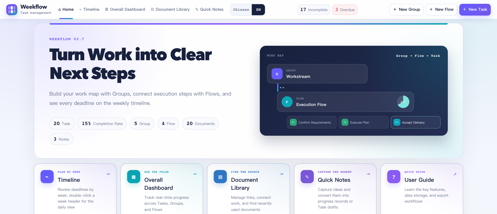

- Home displays Task, Group, Flow, document, note, and completion-rate totals.
- Direct entries open Task by Week, Overall Dashboard, Document Library, Quick Notes, User Guide, and Changelog.
- The top-level **AI Settings** entry configures the provider, model, and API Key. Local Task-draft parsing remains fully available without AI.
- A non-blocking bottom-right reminder lists incomplete Tasks due within seven days and closes automatically after ten seconds.
- `Command/Ctrl + K` opens timeline search from Home or focuses document-name search in the Document Library.

### Task by Week and Task by Day

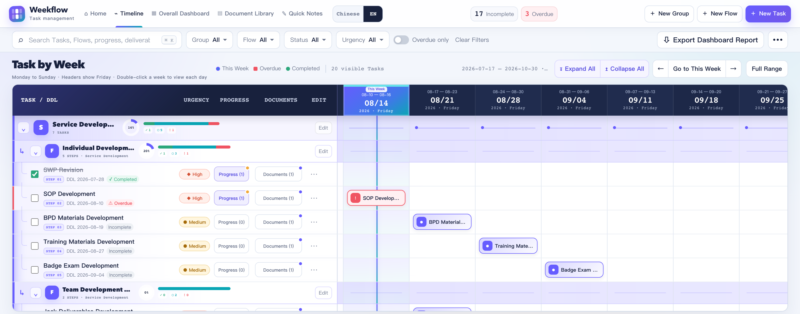

- Task by Week calculates natural weeks from Monday through Sunday; its header date is Friday.
- Browse earlier or later weeks, return to this week, or show the full Task range (up to 600 weeks).
- Double-click a week header to open Task by Day. The selected week is split into Monday through Sunday, and every deadline node lands on its exact date.
- Task by Day shows only Tasks with a deadline occurrence in the selected week, including generated weekly or monthly occurrences.
- Both views retain Group, Flow, Task, filtering, editing, completion, and expand/collapse behavior.
- Completing or reopening a Task preserves the operated Task row, horizontal position, and page position. Expanding or collapsing an individual Group or Flow preserves the operated hierarchy row.

### Groups, Flows, and Tasks

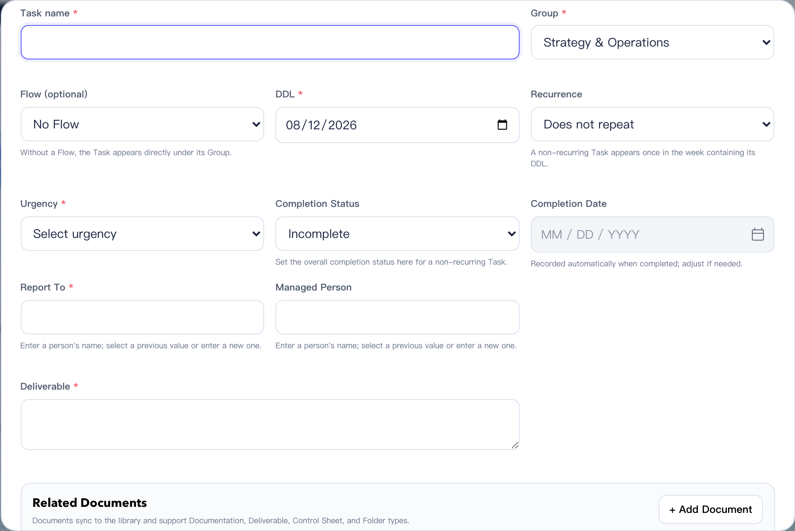

- Tasks support create, edit, delete, complete/reopen, DDL, Urgency, Report To, Managed Person, Deliverable, multi-entry progress history, and related documents.
- Use **+ New Record** to append progress. Every entry keeps its own created and last-edited timestamps; the dialog opens on the latest entry and lets users select, edit, or double-confirm deletion of earlier entries. Rich text supports bold, italic, HTTP/HTTPS links, plus Excel-like 20-color preset palettes for text and highlight colors—no manual color picker is required.

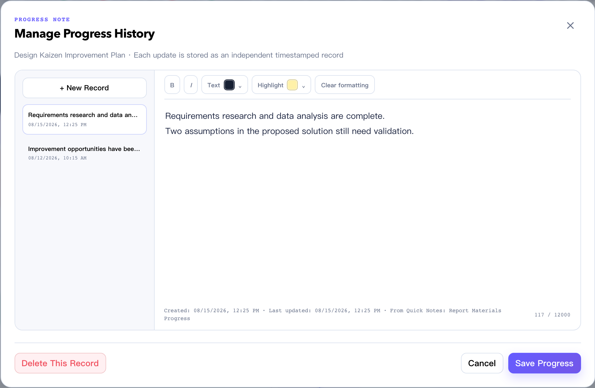

- Urgency, Report To, and Deliverable are required. Report To and Managed Person are person names, and previously used names become suggestions.
- Flow is an optional ordered layer between a Group and its Tasks. A new Flow inherits its Group color unless the user customizes it.
- Reorder Tasks inside a Flow by drag-and-drop or move controls.
- Weekly and monthly recurring Tasks require recurrence start and end dates. The form DDL is the weekday or day-of-month anchor.
- A recurring Task remains one stored and counted Task while rendering all scheduled deadlines. Completing the current natural week or month completes that occurrence and all earlier ones; the next period starts incomplete.

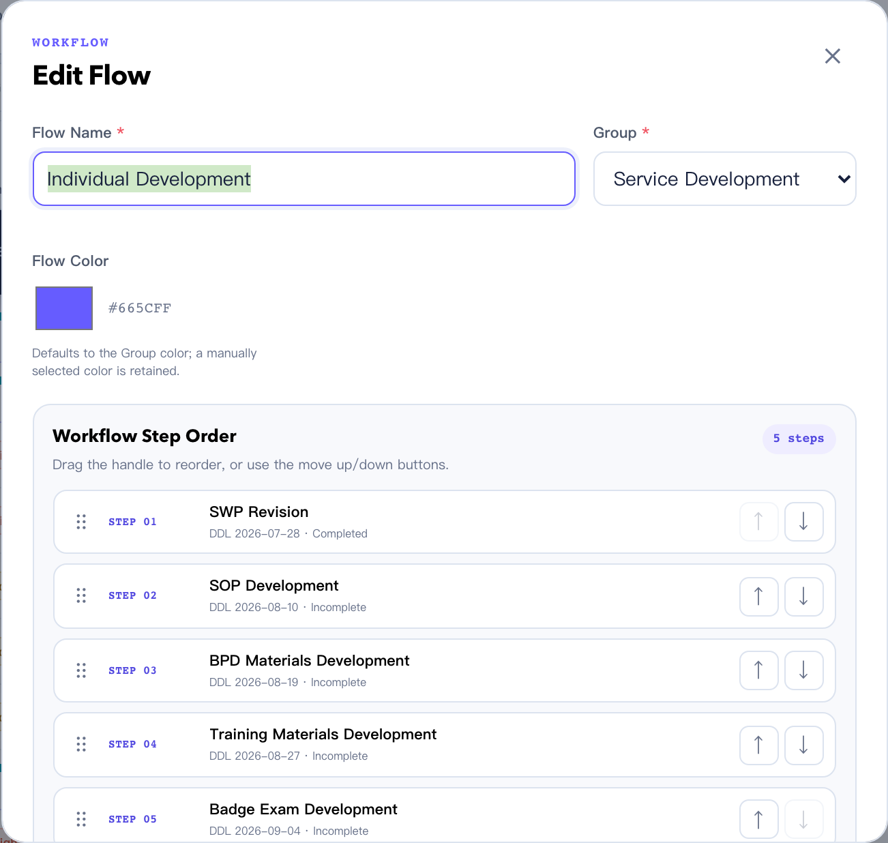

### Quick Notes, AI Assistance, and Task Draft Conversion

- The fourth business page, **Quick Notes**, provides a titled rich-text writing area and a left list sorted by latest update. Search covers title and body; Notes can be starred and filtered through **Favorites**, and unsaved-change prompts protect navigation, note switching, language switching, and page closing.
- Formatting supports bold, italic, five preset font sizes (12/14/16/18/22), pasted SharePoint/HTTP/HTTPS links, and Excel-like 20-color preset palettes for text and highlights. Arbitrary color pickers, images, and attachments remain excluded.
- Paste tables directly from Excel with merged cells preserved. Copy a rectangular selection—or use the floating side handle to select the whole table—back to Excel with the same table and merge structure.
- The hierarchical **Create Table / Edit Table** menu provides a size grid, insert row below, insert column right, delete current row/column, delete the entire table, and merge rectangular selection commands. Horizontal, vertical, and rectangular selections use clear app-owned highlighting without falsely highlighting adjacent text.
- After selecting the whole table with its side handle, Windows `Delete` clears cell contents and `Backspace` removes the table; on macOS, the regular `Delete` key clears contents and `Fn+Delete` removes the table. Both actions are undoable.
- Create, paste, insert, delete, merge, and final-row/final-column removal are native editing-history steps, so `Command/Ctrl + Z` and redo work consistently. AI Rewrite protects every table with a placeholder and restores it after rewriting.

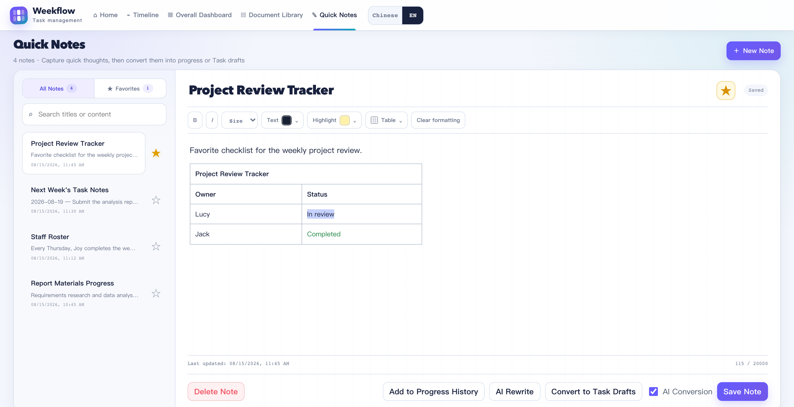

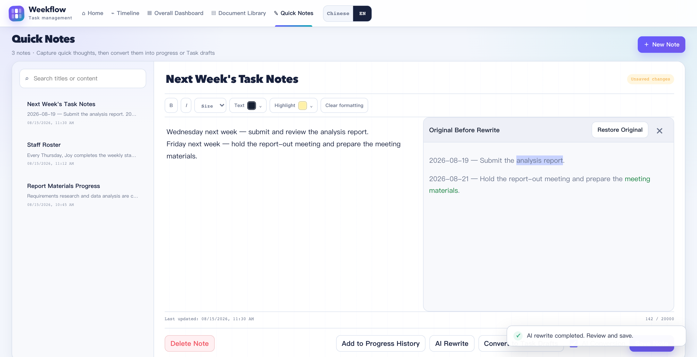

- The screenshot shows **AI Conversion** enabled, an AI Rewrite result, and the restorable **Original Before Rewrite** panel. Users still review and save every AI result themselves.

- **Add to Progress History** selects Group → optional Flow → Task and appends a new timestamped progress entry. The original note remains, and later edits do not synchronize either copy.

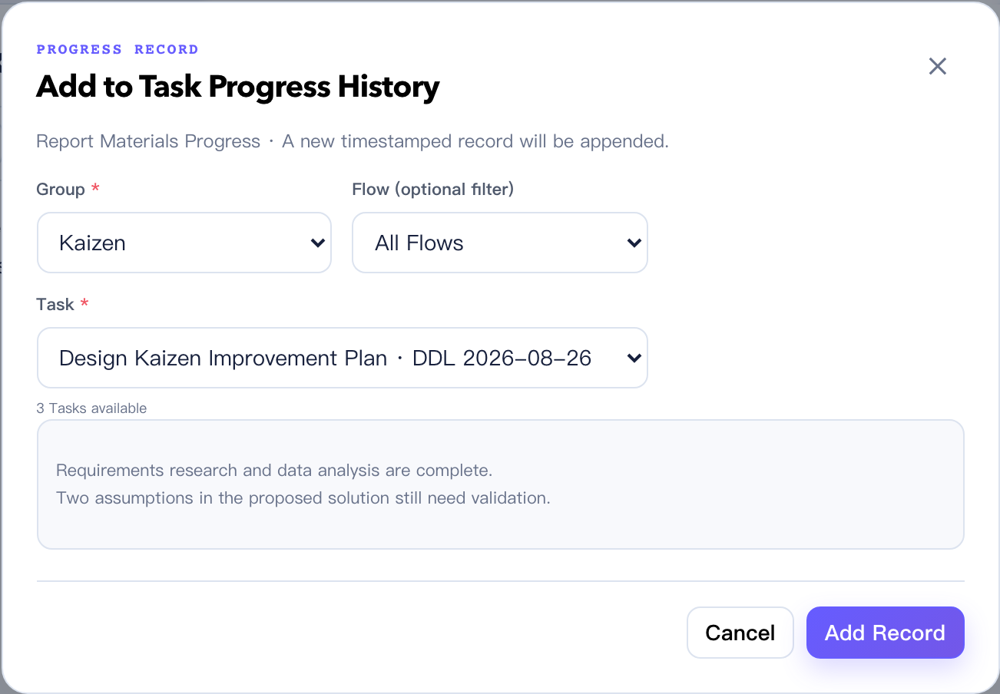

- **Convert to Task Drafts** uses deterministic bilingual local rules by default. After a provider, model, and API Key are configured in **AI Settings** and **AI Conversion** is enabled, semantic splitting and field extraction use AI first; failures and timeouts automatically fall back to local rules. Separate lines beginning with `1 / 2 / 3`, `1. / 2. / 3.`, or Chinese numerals become separate Task candidates by default. Explicit labels and full dates may be prefilled.
- **AI Rewrite** sends the editor's current content for structured rewriting. If the user changes or switches Notes while the request is pending, the late response is discarded instead of overwriting newer content. The API Key stays in the current browser origin's local AI settings and is excluded from business-data JSON backups; clear the connection after use on a shared device.
- Common English labels include `Task / Todo / Action Item`, `Group`, `Flow / Workflow`, `DDL / Deadline / Due Date`, `Urgency / Priority`, `Report To`, `Managed Person`, and `Deliverable`; the corresponding Chinese aliases are recognized as well. `Every Wednesday...` or `每周三……` prefills Weekly recurrence with next Wednesday as both DDL and Recurrence Start. `Monthly on the 5th...` or `每月 5 日……` prefills Monthly recurrence with the 5th of next month. The user still confirms Recurrence End before saving.
- Each non-empty unlabeled line becomes a separate Task candidate by default; field lines such as `DDL:`, `Group:`, and `Flow:` remain attached to the preceding Task. Leading Chinese date expressions such as this/next/the-week-after-next weekday, a bare weekday (current week), `8-25 / 8.25 / 8/25 / August 25`-style numeric Chinese forms, and variants with a two- or four-digit year are removed from the Task name and prefilled as high-confidence DDL values. A yearless month/day uses the current year unless it has already passed, in which case it uses the next year.
- Relative expressions outside those precise prefix rules, plus fuzzy names such as `Servce Development` or `Lcy`, remain suggestions rather than silent form values.
- The split conversion view keeps the source note selectable and copyable, always shows detected count/current position, and supports Previous, Next, Skip, Save & Continue, and **+ Add Task Draft**. A manually added draft can be blank or parsed from selected source text. Conversion completes only after every candidate is saved or skipped.

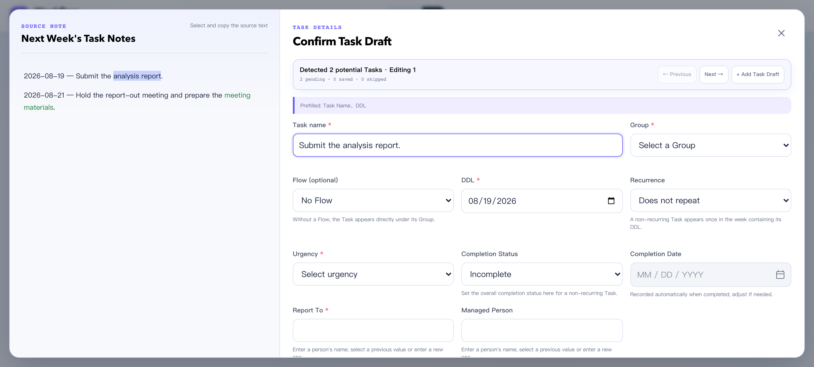

### Related Documents and Document Library

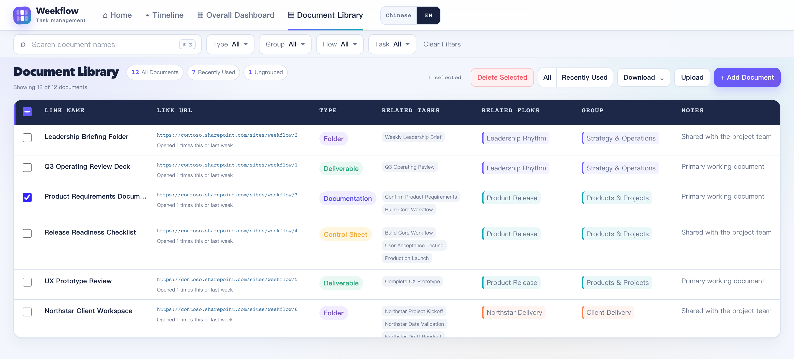

- Documentation, Deliverables, Control Sheets, and Folders share one document record and can relate to multiple Tasks, Flows, and Groups.
- Editing from a Task or the Document Library updates the same data source.
- Switch between **List** and **Group** from the upper right. **Arrange Layout** sits to the left of the List / Group switch and appears only in Group mode.
- **List** keeps the existing full table, name search, and Type, Group, Flow, and Task multi-select filters; Notes are displayed but are not searched.
- **Group** defaults to four Group columns per row. Additional Groups wrap to the next row; every card has a fixed height with its own vertical scroll and shows only a checkbox, document name, and **Go to** button.
- Group mode keeps name search and Type filtering but hides Group, Flow, Task, and Recently Used filters. Documents sort by opens during the current and previous natural week, descending; ties sort by name.
- **Arrange Layout** selects one to four Group columns per row and reorders Groups by dragging or move controls. Applying the dialog saves the preference immediately.

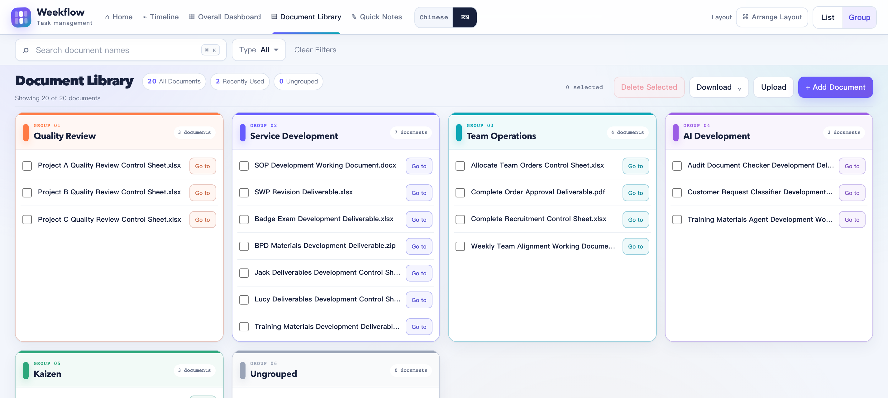

- New or edited relations follow Group → Flow → Task cascading selection.
- In List mode, Recently Used includes links opened at least once in the current or previous natural week.
- Select the current result set from the header checkbox. Individual checkbox changes update in place and do not rebuild or scroll the table to the top.
- Bulk deletion and overwrite-all import each require two confirmations.

### Overall Dashboard

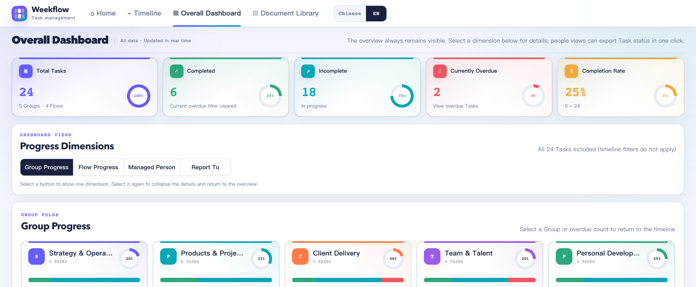

- The five overview metrics—Total Tasks, Completed, Incomplete, Currently Overdue, and Completion Rate—are always visible.
- Open one detail dimension at a time: Group, Flow, Managed Person, or Report To.
- Person summaries show counts and completion rate and export that person's full Task status, sorted by Group.

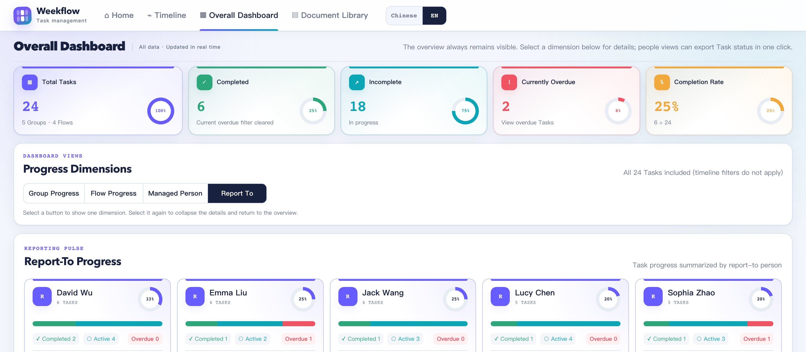

## Data Storage Location

Business data is stored in `localStorage` for the current browser and page origin under:

```text
weekflow-v2.4:data:v4
```

Weekflow v3.2 keeps the v2.4 storage namespace; the internal structure has remained v4 since v3.0. This compatibility key does not indicate that the application is still v2.4.

The top-level data structure is `version: 4` with `groups`, `flows`, `tasks`, `materials`, `notes`, and `preferences`. Task `progressEntries` stores multi-entry progress history; `notes` stores Quick Notes and one-time conversion records. `preferences.documentLibrary` stores List / Group mode, columns per row, and Group order. Recurrence settings remain on each Task, so recurring deadlines do not create duplicate Tasks. Existing v3 `progressNote` content migrates into one history entry, and older same-origin releases remain readable.

Clearing site data, using a private window, changing browsers, or changing the launch origin changes which data is visible.

## Data Backup and Restore

Before bulk import, complete replacement, overwrite-all Document import, browser migration, or large deletion:

1. Open the `•••` data menu.
2. Select **Export JSON Backup**.
3. Store the `.json` file in a controlled location.

Use **Restore from JSON** to restore. Weekflow validates versions, unique IDs, dates, Group/Flow/Task relations, recurrence ranges and completion history, document types, URLs, relations, and open events before asking for confirmation. It attempts a `pre-import-backup` before replacement.

The JSON backup includes the complete data object: Groups, Flows, Tasks, every progress entry, all documents including unlinked ones, Quick Notes, conversion records, and layout preferences. Restoring it restores the same notes and layout. For backward compatibility, document records remain stored under the internal `materials` property.

## Excel Bulk Import

### Task Import

Open `••• → Bulk Import`:

- **Download Excel Import Template** creates a blank 20-column workbook in the active language.
- **Download Current Data in Import Format** exports every current Task in the same 20-column main sheet and stores every progress entry in a separate **Progress History** worksheet for editing and re-upload.
- **Upload Excel for Bulk Import** validates a workbook, shows errors and a preview, then offers Supplement Import or double-confirm Complete Replacement.

Each row represents one Task. `Group*`, `Task Name*`, `DDL*`, `Urgency*`, `Report To*`, and `Deliverable*` are required. Flow is optional. Recurring Tasks require Recurrence Start and Recurrence End. `Recurrence Completion History` uses `occurrence DDL|completion date`, with periods separated by new lines or semicolons. One upload supports up to 1,000 Tasks.

Supplement Import keeps existing data and adds Tasks. Complete Replacement replaces all Groups, Flows, and Tasks but does not delete Document Library entries; matching hierarchy IDs are reused when possible to preserve relations. Legacy files containing only one Progress Note remain accepted as one history entry. New files aggregate all entries newest-first in the main cell and retain one entry per row in Progress History. If the 32,767-character Excel cell limit is reached, the aggregate is marked and truncated while the complete history remains in Progress History and JSON.

### Document Import

Use `Document Library → Download → Download Blank Template`, then upload from **Upload**.

- `Link Name*` and `Link URL*` are required.
- Type is Documentation, Deliverable, Control Sheet, or Folder; blank defaults to Documentation.
- Related Tasks, Flows, and Groups must already exist on the timeline. Use full paths such as `Group/Flow/Task` when names are ambiguous.
- Multiple relations use new lines or semicolons. A blank relation set is Ungrouped.
- Supplement Import can replace or skip duplicate URLs. Overwrite All removes the existing library after two confirmations and imports the workbook.
- One upload supports up to 2,000 documents.

## Excel Export

### Dashboard Report

**Export Dashboard Report** creates:

```text
Task_Dashboard_YYYYMMDD_HHmm.xlsx
```

The workbook contains:

1. `Overall Dashboard`: export time, overall metrics, Group summary, and Flow summary.
2. `Timeline Dashboard`: fixed Task fields, recurrence settings, all progress entries in one newline-separated cell, related documents, and the complete weekly deadline range.
3. `Progress History`: one row per entry with its ID, created time, last-edited time, source, and source Note ID.

The report always includes all Tasks regardless of timeline filters. It is a presentation workbook, not an import file; use **Download Current Data in Import Format** for re-import.

### Managed Person and Report To Reports

The corresponding Overall Dashboard dimensions export:

```text
Managed_Person_Name_Task_Status_YYYYMMDD_HHmm.xlsx
Report_To_Name_Task_Status_YYYYMMDD_HHmm.xlsx
```

Each workbook includes only the selected person’s Tasks, sorted by Group, with Flow/step, Task Name, people fields, Deliverable, DDL, recurrence, Urgency, completion, overdue state, complete progress history, and related document names and URLs. It uses the same three-sheet report structure.

### Document Library

`Document Library → Download → Download Document Library` creates:

```text
Weekflow_Document_Library_YYYYMMDD_HHmm.xlsx
```

It includes Link Name, URL, Type, complete Task/Flow paths, Groups, and Notes. URLs remain clickable.

### Windows Excel Compatibility

Every generated `.xlsx` is repackaged through the same safety path. The package removes false macro markers and workbook code names, sets `DocSecurity=0`, and rejects VBA, external workbook links, data connections, ActiveX, and embedded OLE content. Dashboard and person reports include standard workbook views and AutoFilter defined names and do not open with frozen panes.

## Program Files

The entire folder is required; do not move only `Weekflow.html`. It depends on `css`, `js`, `vendor`, and the release files. The two legacy Chinese template files under `templates/` remain for offline compatibility, while UI template downloads are generated dynamically in the active language.

```text
Weekflow/
├── Weekflow.html
├── css/styles.css
├── js/ai-provider.js
├── js/i18n.js
├── js/app.js
├── js/automation.js
├── js/date-utils.js
├── js/excel-export.js
├── js/excel-import.js
├── js/material-excel.js
├── js/materials.js
├── js/rich-text.js
├── js/stats.js
├── js/storage.js
├── js/task-draft-parser.js
├── js/xlsx-safe.js
├── js/utils.js
├── templates/
├── vendor/
├── tests/
├── CHANGELOG.md
├── RELEASE.txt
└── package.json
```

## Development Team

- Developer: Wesley Yan
- First release (v1.0): July 30, 2026
- Latest release (v3.2): August 29, 2026
- Bilingual interface release: August 12, 2026

## Security and Limits

- User content is rendered with DOM APIs rather than inserted as executable HTML.
- Links accept only `http:` and `https:` and open with `noopener,noreferrer`.
- Restore, import, and persistence paths validate structured data.
- Weekflow has no backend, account, cloud synchronization, or multi-user collaboration. SharePoint URLs are stored only as HTTPS links; the app does not call SharePoint APIs.
- The desktop UI is validated at 1280 px and wider; narrower screens retain horizontal scrolling where needed.

Development collaboration attribution: Wesley Yan
